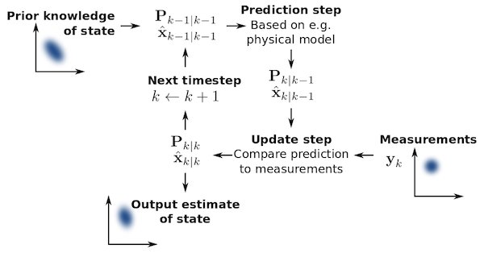

# KALMAN FILTER

- https://www.kalmanfilter.net ★★★★★★
- https://www.bzarg.com/p/how-a-kalman-filter-works-in-pictures/

Kalman filters provide a much better estimate of the true state of a system than other “smoothing” techniques, such as moving averages (exponential and simple).

From a “noisy” signal over time, a kalman filter creates estimates of the true signal.
Given a “noisy” signal, a kalman filter creates an estimate of the true state by parameterizing the signal with the following function:

$$x_k =F_k​ x_{k−1} + B_k u_k + w_k$$
​
- k current state
- k-1 previous state
- F state transition model (matrix), applied to the previous state. 
The product of the state transition matrix and the observation at time k-1 gives an estimate of the state at k
- B is a control state model applied to a “control vector,” u.
The control state model is only applicable with control inputs, such as the angle of the accelerator pedal in the case of velocity estimates for a vehicle. In these cases, the product of the control state model along with the inputs at time k-1 also add to the estimate of the true state.
- w is the noise, assumed to be Gaussian.

Few software engineers and scientists seem to know about it
For systems which are continuously changing
Tool for combining information in the presence of uncertainty
When you have uncertain information about some dynamic system, and you can make an educated guess about what the system is going to do next.
Its ability to extract accurate information seems almost magical

Provides a true state estimate for a real time system 
- Tracking the actual values for highly sensitive sensors
- Tracking the velocity of objects with uncertainty

### IMU - INERTIAL MEASUREMENT UNIT

- [Kalman filter-based IMU](https://www.bzarg.com/p/improving-imu-attitude-estimates-with-velocity-data/)
- https://github.com/pms67/EKF-Quaternion-Attitude-Estimation
- https://github.com/pms67/Attitude-Estimation

### More

- https://www.youtube.com/watch?v=CaCcOwJPytQ&list=PLX2gX-ftPVXU3oUFNATxGXY90AULiqnWT
- http://www.allaboutcircuits.com/technical-articles/how-sensor-fusion-works/
- https://sam-black.medium.com/online-kalman-filters-for-streaming-iot-data-43d8c861599b

The Kalman Filter
At its heart, the algorithm has a set of “belief” factors for each sensor.  
Each loop, data coming from the sensors is used to statistically improve the location guess,  
but the quality of the sensors is judged as well.  

Robotic systems also include constraints that encode the real-world knowledge that 
physical objects move smoothly and continuously through space (often on wheels), rather 
than teleporting around like GPS coordinate samples might imply.

That means if one sensor which has always given excellent, consistent values starts 
telling you unlikely and frankly impossible things (such as GPS/radio systems when 
you go into a tunnel), that sensors' believability rating gets downgraded within a 
few millisecond iterations until it starts talking sense again.

This is better than just averaging or voting because the Kalman filter can cope 
with the majority of its sensors going temporarily crazy, so long as one keeps 
making good sense. It becomes the lifeline that gets the robot through the dark times.

The Kalman filter is an application of the more general concepts of Markov Chains 
and Bayesian Inference, which are mathematical systems that iteratively refine their 
guesses using evidence. These are tools designed to help science itself test ideas 
(and are the basis of what we call “statistical significance”).

